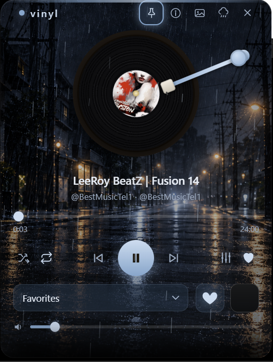
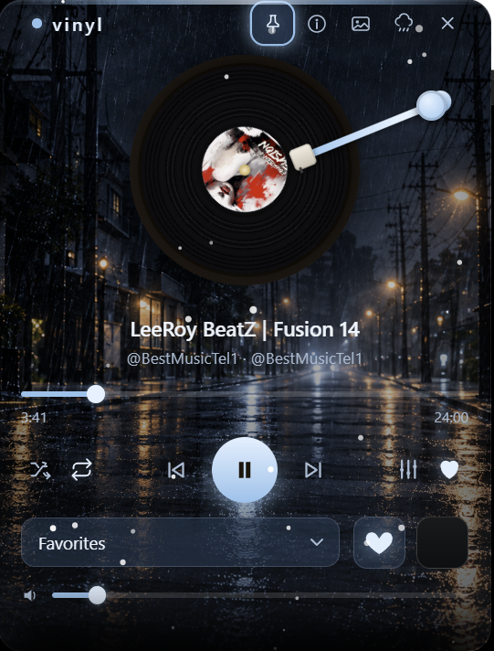
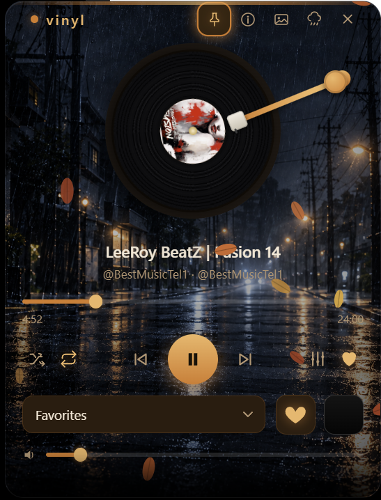

# Vinyl

A turntable-style tray music player for Windows, built with Electron.

## Download for Windows

Get the [latest release](https://github.com/mohammadrezasmz2/vinyl-tray-player/releases/latest):

- **Setup-x64.exe**: installer for 64-bit Windows; choose an installation folder.
- **Windows-x64.zip**: extract the entire archive, then run `Vinyl.exe`.

Vinyl opens from its system-tray icon. The release includes source, SHA-256
checksums, and the Windows package test results. These community builds are
unsigned. See the [Persian Windows guide](docs/WINDOWS.fa.md).

See the [Code signing policy](CODE_SIGNING.md) for the submitted SignPath
Foundation application and the current unsigned status, and the
[Privacy policy](PRIVACY.md) for local data handling. In packaged version 1.6.4,
**Start with Windows is enabled by default**; turn it off in the tray menu if
you do not want Vinyl to start when you sign in.

<p align="center">
  
  
  
</p>

## Run from source

Install Node.js 24 and Git on Windows, then run:

```sh
git clone https://github.com/mohammadrezasmz2/vinyl-tray-player.git
cd vinyl-tray-player
npm ci
npm start
```

The first launch downloads the pinned Electron runtime. Vinyl starts in the
system tray: click its icon to open the player, then choose a music folder or
individual audio files. Use the tray menu to quit.

Development runs do not register Windows autostart. That setting is enabled
only in a packaged Windows application.

## Features

- Local audio library, favorites, shuffle, and repeat.
- Turntable interface, themes, custom backgrounds, and a six-band equalizer.
- Ambient sound layers with saved volume and intensity settings.
- Tray controls, pinning, and opening audio files from the command line.

The library recognizes MP3, M4A/MP4, AAC, FLAC, WAV, OGG/OGA, Opus, and
WebM/WebA files. Actual playback depends on the file's codec and the Electron
runtime.

## Development checks

```sh
npm run check
npm test
npm audit
```

On Windows, also run `npm run test:electron`. This launches the real application
with temporary settings and a generated WAV file, and checks the sandboxed UI,
IPC, media access, metadata, playback, and seeking.

GitHub Actions runs the source checks and regression tests on Linux and Windows,
and the Electron smoke test on Windows. It uses the committed lockfile and
Node.js 24.

## Build a Windows release

On Windows, after `npm ci`:

```sh
npm run build:win
```

The NSIS installer and ZIP appear in `dist/`. The pinned electron-builder
configuration retains the original icon, includes production dependencies and
license notices, and excludes development tooling from the packaged app.

The Windows release workflow additionally extracts and launches the ZIP, performs
a silent installation, launches the installed executable, and uninstalls it in a
disposable CI runner. Publishing starts only after these checks pass. See
[CONTRIBUTING.md](CONTRIBUTING.md) for maintenance and release steps.

## Project files

- `main.js`: Electron main process, tray menu, settings, and local media access.
- `lib/`: media streaming, validated settings, and IPC sender checks.
- `preload.js`: renderer-to-main IPC bridge.
- `renderer/index.html`, `renderer/renderer.js`, `renderer/styles.css`: player UI.
- `assets/`: tray icons.
- `scripts/`, `test/`, `.github/workflows/`: development and regression checks.
- `package.json`, `package-lock.json`: application metadata and pinned dependencies.

## Source and release status

The current version is **1.6.4**. It uses Electron 44.4.3,
electron-store 8.2.0, and music-metadata 11.15.0. See [CHANGELOG.md](CHANGELOG.md)
for fixes and [the release notes](docs/RELEASE_NOTES.md) for validation scope.

The original 1.6.3 source was recovered from `resources/app.asar` in the supplied
Windows package. All 895 ASAR entries matched their stored SHA-256 hashes. The
eight original application files are preserved at
[the recovery baseline](https://github.com/mohammadrezasmz2/vinyl-tray-player/tree/a9c4f4a915e9e9027e66e09e201b666fa64b8bc0).
That package bundled Electron 31.7.7 and music-metadata 7.14.0.

The automated tests cover a generated WAV, programmatic playback and seeking,
ZIP startup, and silent installation/uninstallation. Manual listening, the
interactive installer screens, upgrade from the recovered 1.6.3 installer, and
packaged autostart have not been verified. Generated runtimes and `node_modules`
are excluded from Git.

## License

[MIT](LICENSE), consistent with the license declared by the supplied application.
Full production dependency notices are in [THIRD_PARTY_NOTICES.txt](THIRD_PARTY_NOTICES.txt).
The distribution also retains Electron's LICENSE.electron.txt and LICENSES.chromium.html.
See [license provenance](licenses/README.md).
